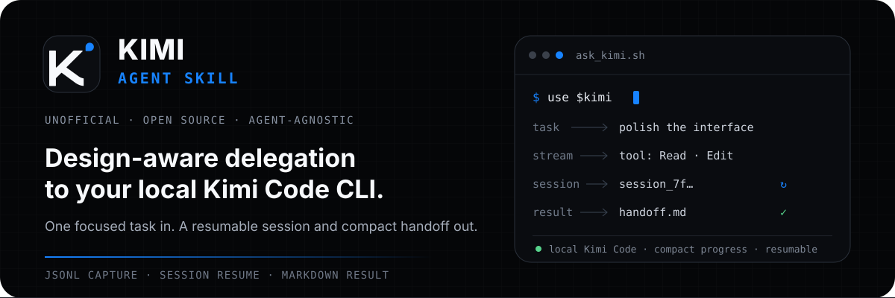

<p align="center">
  
</p>

<p align="center">
  <strong>Delegate focused coding and design tasks from any Agent to your local Kimi Code CLI.</strong><br>
  <sub>让任意 Agent 稳定地调用本地 Kimi Code：捕获进度、续接会话，并返回紧凑的 Markdown 结果。</sub>
</p>

<p align="center">
  <a href="#install">Install</a> ·
  <a href="#first-task">First task</a> ·
  <a href="#capabilities">Capabilities</a> ·
  <a href="#limits-and-safety">Limits</a>
</p>

## What this is

将设计、前端实现、代码探索、评审及媒体分析交给本地命令行 Agent，支持持续会话。

Kimi is especially useful when a task benefits from strong UI/UX judgment, visual direction, design-system thinking, or polished frontend implementation. The wrapper adds the orchestration layer that a calling Agent needs: focused context, JSONL capture, compact progress, resumable sessions, and a Markdown handoff.

```text
Agent request → ask_kimi.sh → Kimi stream-json → result.md + session_id → Agent review
```

## Proof, not ceremony

```console
$ ./scripts/ask_kimi.sh "Review this interface and improve the layout" \
    --workspace ./my-app \
    --file src/App.tsx \
    --file references/current-ui.png

[kimi] tool: Read
[kimi] tool: Edit
session_id=session_…
output_path=…/.runtime/20260718-….md
elapsed=12s
```

The caller reads the result, reviews the workspace changes, and can resume the same Kimi session for a genuine follow-up.

## Install

### Requirements

- macOS or Linux with Bash 3.2+
- [Kimi Code CLI](https://github.com/MoonshotAI/kimi-code) installed and authenticated
- [`jq`](https://jqlang.org/) available on `PATH`
- An Agent that can load `SKILL.md` and run local shell commands

Clone the repository, then link it into the Skill directory used by your Agent:

```bash
git clone https://github.com/oil-oil/kimi.git
cd kimi
export AGENT_SKILLS_DIR="/path/to/your/agent/skills"
mkdir -p "$AGENT_SKILLS_DIR"
ln -s "$PWD" "$AGENT_SKILLS_DIR/kimi"
```

If a `kimi` Skill already exists in that directory, update or remove it intentionally before creating the link. Hosts may also load this repository's `SKILL.md` directly without a symlink.

## First task

Invoke the Skill from your Agent:

```text
Use $kimi to inspect this repository and implement the requested change.
```

Or verify the wrapper directly:

```bash
./scripts/ask_kimi.sh \
  "Explain the active request path" \
  --workspace "/path/to/repository" \
  --file "src/main.ts"
```

Resume the returned session:

```bash
./scripts/ask_kimi.sh \
  "Now add the missing regression test" \
  --workspace "/path/to/repository" \
  --session "session_..."
```

## Capabilities

- **Design-aware delegation** — favor Kimi for interface critique, layout, typography, design systems, and frontend polish.
- **Focused context** — pass 1–4 priority code, image, or video paths without pasting their contents into the prompt.
- **Session continuity** — capture Kimi's session ID and resume only when prior context is valuable.
- **Compact handoff** — save the final response and tool summary as Markdown instead of forwarding raw JSONL.
- **Failure diagnostics** — preserve useful errors while truncating output and redacting common token patterns.

### Wrapper options

| Option | Purpose |
| --- | --- |
| `--workspace <path>` | Run Kimi from a chosen working directory. |
| `--file <path>` | Add a priority code or media hint; repeatable. |
| `--session <id>` | Resume a previous Kimi session. |
| `--model <alias>` | Use a locally configured Kimi model alias. |
| `--add-dir <path>` | Add another accessible workspace directory; repeatable. |
| `--skills-dir <path>` | Replace Kimi's auto-discovered Skill directories for this run. |
| `--output <path>` | Choose the Markdown result path. |

Task text can be the first positional argument, `--task`, or stdin.

## Limits and safety

### Kimi can inspect images, but it cannot generate them

Use image and video paths as visual references for analysis, critique, or frontend implementation. Do **not** delegate image generation or image editing to this Skill; use a dedicated image tool for PNG, JPEG, WebP, or other image deliverables.

### Prompt mode is not a read-only sandbox

Kimi's non-interactive prompt mode may edit files or run commands under its automatic permission policy. It cannot be combined with Kimi's interactive `--plan` mode, so this wrapper deliberately does not pretend to offer `--read-only`. Use it only in trusted workspaces and only when the requested mutations are authorized.

## Repository layout

```text
.
├── SKILL.md                 # Triggering metadata and agent workflow
├── agents/openai.yaml       # Optional metadata for OpenAI hosts
├── scripts/ask_kimi.sh      # Deterministic Kimi Code wrapper
└── assets/readme/hero.svg   # GitHub-safe project hero
```

## Validate changes

```bash
bash -n scripts/ask_kimi.sh
scripts/ask_kimi.sh --help
python3 /path/to/skill-creator/scripts/quick_validate.py .
```

For behavioral changes, test a harmless new session, a resumed session, and one read-only tool call before publishing.

## Contributing

Issues and focused pull requests are welcome. Keep the Skill concise, preserve macOS Bash 3.2 compatibility, and verify behavior against the currently installed `kimi --help` rather than assuming another Agent CLI uses the same flags.

## License

The Skill and wrapper are released under the [MIT License](./LICENSE).

Kimi and the Kimi logo are trademarks or brand assets of Moonshot AI. This project is unofficial, is not affiliated with or endorsed by Moonshot AI, and uses the official mark only to identify Kimi Code compatibility. See [NOTICE](./NOTICE); the logo is not covered by this repository's MIT license.

## 配置、依赖与使用边界

需要可用的 Kimi CLI、Python 与官方认证；复用已有登录，不在聊天收集 API Key。具体图像输入能力按当前 CLI 检查。

仅传任务需要的文件与图像；外部模型可能计费，输出仍需按用户要求验证，不把模型自述当成验收。

使用示例：

```text
用 Kimi 评审这个页面，先给出基于现有组件的改进意见。
```

## GitHub 安装

把 [仓库地址](https://github.com/oil-oil/kimi) 交给 Agent，要求按 README 安装；也可运行：

```bash
npx skills add oil-oil/kimi
```

安装后由宿主重新加载 Skill。
